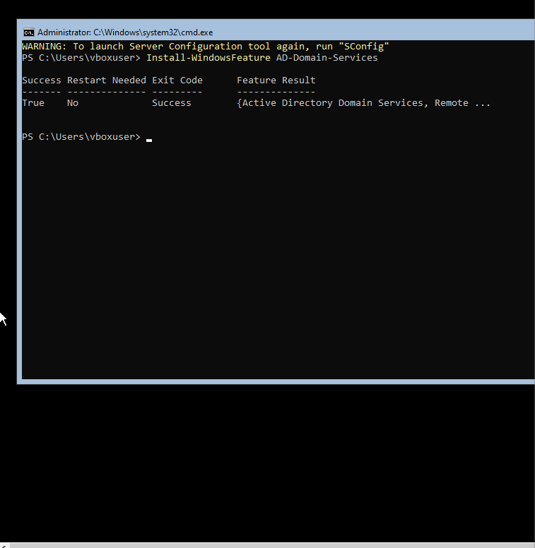
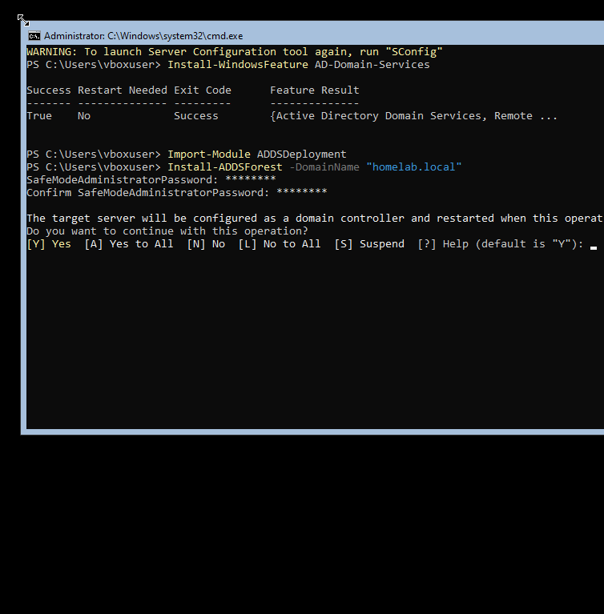
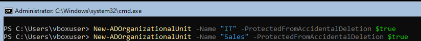
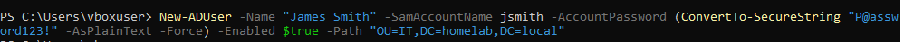
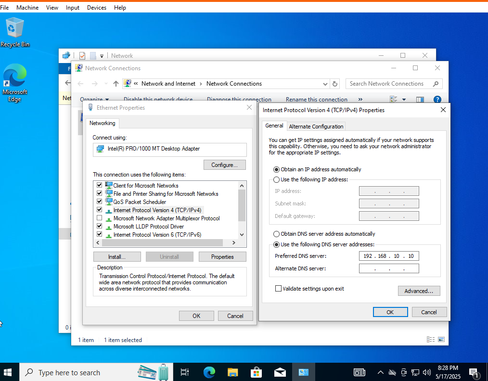
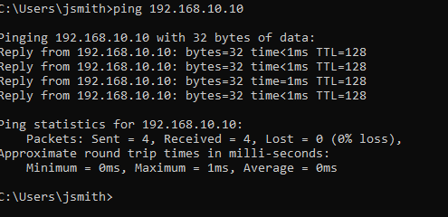
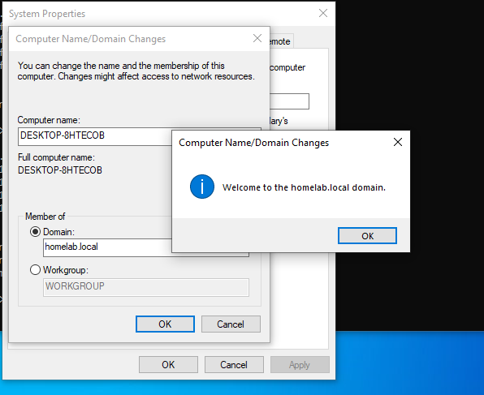
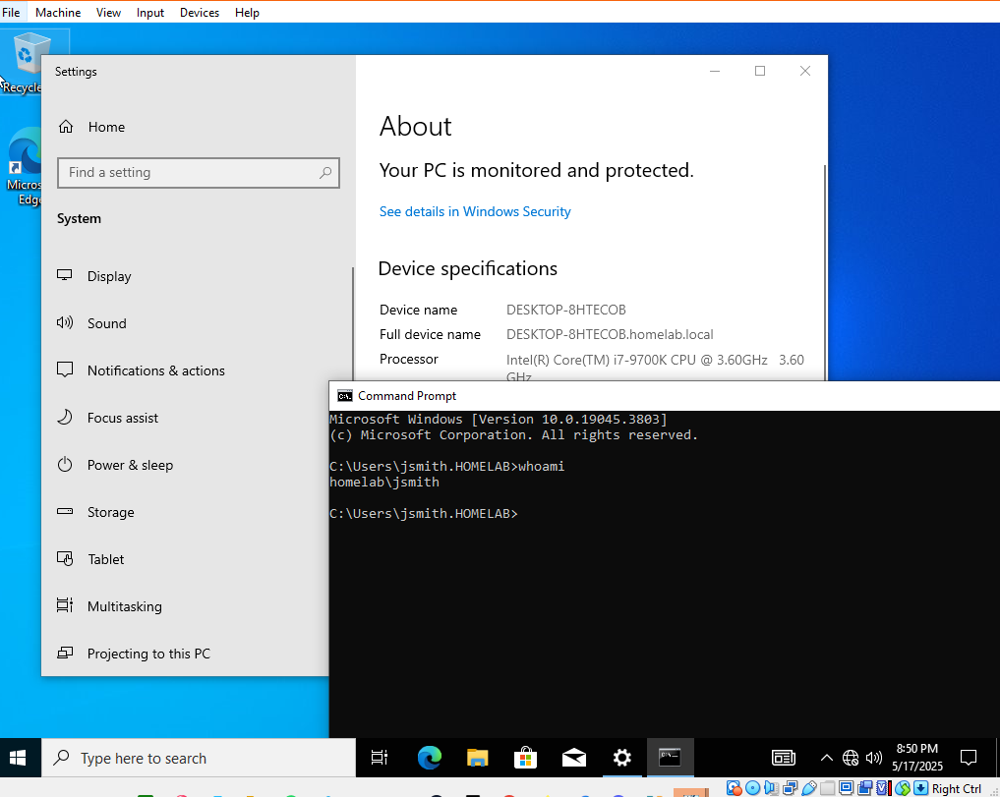

# Active Directory Home Lab

## Project Overview

This project is meant to simulate a real-world example of configuring an IT environment by deploying a virtual Windows Active Directory lab.
This is meant to demonstrate fundamentals of sysadmin skills such as domain setup, user and OU management, and virtual networking.

**Tech Stack:**
- Windows Server 2022 Core (Domain Controller)
- Windows 10 Pro (Domain-joined client)
- VirtualBox

---

## Objectives & Learning Outcomes

- Deploy Windows Server Core as an Active Directory Domain Controller
- Configure static IP's and internal VM connectivity
- Create and manage organizational Units (OUs), users, and groups with PowerShell
- Join a Windows 10 Pro client to the domain and log in as a domain user

---

## Project Steps

### 1. Virtual Lab Setup

- **Created two VMs** in virtualBox: Windows Server 2022 (Server Core) and Windows 10 Pro.
- Configured both VMs on an **Internal Network** for isolated, secure communication
- Set **static IP addresses** to ensure reliable domain services.

### 2. Active Directory Deployment

- Installed the **Active Directory Domain Services (AD DS)** role using PowerShell
- Promoted the server to a Domain Controller for the custom domain `homelab.local`.

**Screenshot:**

**Screenshot:**

---

### 3. AD Organizational Structure

- Used PowerShell to **create custom OUs** such as `IT` and `Sales`.
- Created test user account (e.g., `James Smith` / `jsmith`) and assigned user to IT OU.

**Screenshot:**

**Screenshot:**

---

### 4. Client Domain Join

- Set the Windows 10 client's DNS to point to the domain controller.
- Pinged the Domain Controller Static IP to verify connection.
- **Joined the client VM to the `homelab.local` domain.**
- Logged in to Windows 10 using the test domain account to verify domain function.

**Screenshot:**

**Screenshot:**

**Screenshot:**

**Screenshot:**

---

## Key Skills Demonstrated

- Windows Server Administration (Server Core, AD DS)
- Active Directory user, group, and OU management with PowerShell
- Virtual networking and static IP configuration
- Step-by-step documentation of technical processes

---

## Reflection

> "This project was fun and gave me alot of hands-on experience with setting up, configuring and managing Active Directory infrastructure from scratch. I overcame real troubleshooting challenges around internal network communications and syntax issues for Server Core 2022, which helped me build confidence in supporting Windows evironments. This will help me better understand the workflow for onboarding users, managing domain clients, and documenting my technical solutions in a professional IT setting in the future."
---

## My Next Steps soon

- Expirement with Group Policy Objects (GPOs) for centralized management
- Add more clients and add one for Windows 11 Pro/Edu as additional domain-joined devices
- Explore remote administration with RSAT and advanced AD management

---
